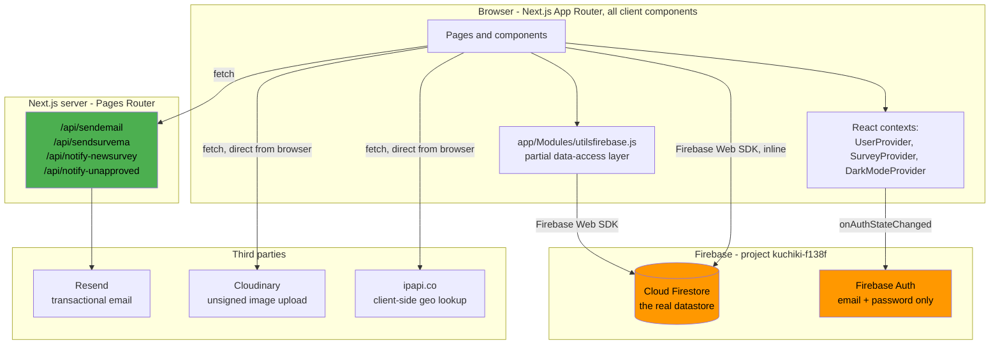
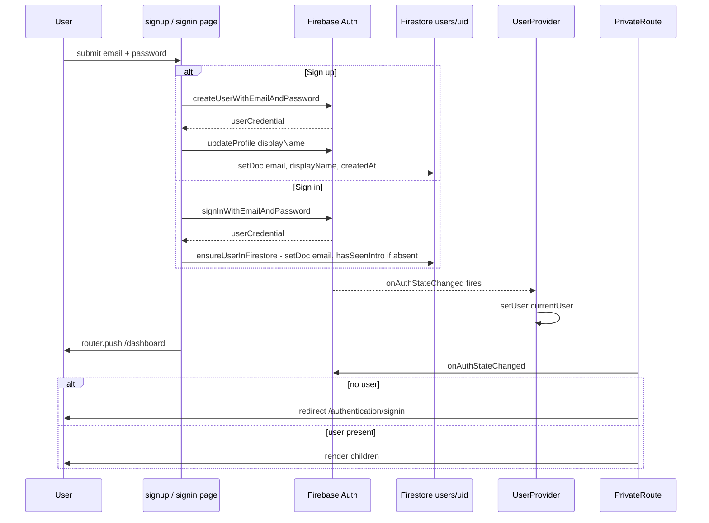
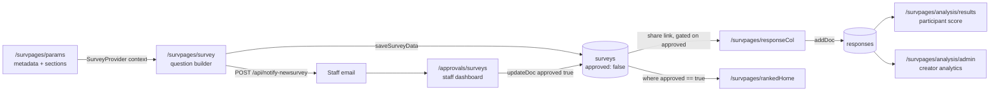

# Architecture

> Evidence labels: **VERIFIED** (observed in code/runtime) · **INFERRED** · **UNKNOWN**.
> See [README.md](README.md).

## 1. What the system is

KUCHIKI is a survey and data-services platform built on Next.js 16 and Firebase. It offers
four distinct services, each reachable from the landing page ([app/page.jsx](../app/page.jsx)):

| Service | Entry route | What it does |
|---|---|---|
| **Survey creation** | `/survpages/params` → `/survpages/survey` | Build multi-section surveys, distribute by link/email, collect and analyse responses |
| **Product testing** | `/product` | Image-based product review questionnaires with Cloudinary-hosted images |
| **Research requests** | `/research` | Submit a research brief with an urgency level; notifies staff by email |
| **Record digitization** | `/digitize` | Submit documents for OCR/digitisation; notifies staff by email |

Users are survey creators (authenticated) and survey respondents (see the open question in
§7). Staff approve surveys through the `/approvals/*` dashboards.

## 2. System shape (VERIFIED)

This is a **client-heavy Firebase application**. There is effectively **no backend tier**:
React client components talk to Firestore directly through the Firebase Web SDK. The only
server-side code is four Pages-Router API routes whose sole purpose is sending email.

Understanding this is the single most important architectural fact about the project.
It means **all business rules live in the browser and are advisory only** — the real
enforcement boundary is `firestore.rules`.



**Consequences of this shape**, which every future change must respect:

1. There is no server-side place to put a business rule today. Adding one means either a new
   API route or a Firestore security rule.
2. Firestore security rules are the *only* real authorization boundary. See
   [SECURITY-FINDINGS.md](SECURITY-FINDINGS.md) C2 — today they enforce almost nothing.
3. Every Firestore read is billed and latency-bound per document. The N+1 patterns in
   [TECH-DEBT.md](TECH-DEBT.md) M3 are a direct result.

## 3. Technology stack (VERIFIED)

| Layer | Choice | Version installed |
|---|---|---|
| Framework | Next.js (App Router + Pages Router together) | 16.3.0 |
| UI runtime | React | 19.2.8 |
| Component library | Ant Design (`antd`) | 5.29.3 |
| Styling | Tailwind CSS 3 + hand-written CSS in `app/globals.css` | 3.x |
| Animation | `framer-motion` | 12.x |
| Notifications | `react-hot-toast` (plus 8 stray `alert()` calls) | 2.x |
| Auth | Firebase Auth, email/password provider only | firebase 11.10.0 |
| Database | Cloud Firestore | firebase 11.10.0 |
| Server auth | `firebase-admin` (token verification) | 13.x |
| Email | Resend | 4.x |
| Image hosting | Cloudinary (unsigned browser upload) | REST API |
| Charts | `chart.js` + `react-chartjs-2` | 4.x / 5.x |
| Build | Turbopack (Next 16 default) | — |
| Language | JavaScript. `typescript` is a devDependency and the build runs a TS pass, but there are **no** `.ts`/`.tsx` files | — |

**Not used, despite being configured:**

- **Firebase Data Connect** (`dataconnect/`) — every line of `schema.gql`, `queries.gql` and
  `mutations.gql` is commented-out Firebase movie-app boilerplate. Postgres is not part of
  this system. (VERIFIED)
- **Cloud Functions** (`functions/index.js`) — wraps Next.js for SSR, but no hosting rewrite
  references it. Dead. (VERIFIED)
- **Firebase Storage** — `storage.rules` denies all access and no code calls Storage.
  Images go to Cloudinary instead. (VERIFIED)
- 11 unused npm dependencies — see [TECH-DEBT.md](TECH-DEBT.md) L3.

## 4. Repository map

```
app/                      App Router. Every page is a client component.
  layout.js               Root layout; imports globals.css, leaflet.css, fontawesome
  providers.jsx           Mounts all three contexts + Toaster + KLogo header + font menu
  page.jsx                Landing page. ALSO exports KLogo, the global header
  authcont.js             UserProvider - Firebase Auth state
  privateRoute.js         Client-side auth gate (redirects to sign-in)
  firebaseConfig.js       Firebase Web SDK init - exports db and auth
  firebaseAdmin.js        Firebase Admin SDK init - exports verifyIdToken
  globals.css             Global CSS incl. hand-written .dark rules
  Modules/                Shared components and helpers (see below)
  authentication/         signin, signup
  dashboard/              Authenticated home
  approvals/              surveys, qanvas - staff approval dashboards
  survpages/              The survey subsystem (see section 5)
  product/                Product-testing builder
  product-review/         Product-testing respondent page
  productResponses/       Product-testing results
  research/               Research request form
  digitize/               Digitization request form
  responses/              Combined survey + product response dashboard

pages/api/                Pages Router. Server-side only. Email sending.
functions/                Cloud Functions (dead - no hosting rewrite points here)
dataconnect/              Firebase Data Connect (entirely commented-out boilerplate)
public/                   Static assets + the only thing Firebase Hosting would serve
docs/                     This documentation
```

### `app/Modules/` — the shared layer

| File | Purpose | Notes |
|---|---|---|
| `utilsfirebase.js` | Partial data-access layer | The closest thing to a repository. Many pages bypass it — see §6 |
| `darkmodecont.js` | `DarkModeProvider` / `useDarkMode` | Persists to `localStorage` |
| `fonts.js` | Floating font/dark-mode settings menu; also owns **sign-out** | Odd coupling: a UI preferences module holds `signOut` |
| `countries.jsx` | 22,741-line country/region dataset | 67% of the entire codebase by line count |
| `country.jsx` | Country/state picker built on `countries.jsx` | |
| `slider.jsx` | Urgency slider for research requests | |
| `automark.jsx` | Auto-marking toggle for surveys | |
| `cartoons.jsx`, `cartoons2.jsx` | Rough.js hand-drawn survey cards for the Ranked feature | |
| `impreview.jsx` | Image preview modal for product testing | |
| `toast.jsx` | Toast helper | |
| `emnotif.js` | `sendEmailNotification` — POSTs to `/api/sendemail` | |
| `emadmin.js` | A research-requests admin page **that is not routed** | Dead |
| `authfetch.js` | `authenticatedFetch` — attaches a Bearer ID token | **Orphaned, imported by nothing** |
| `admin.js` | `currentUserIsAdmin` — reads the `admin` custom claim | **Orphaned, imported by nothing** |
| `motion.js` | A no-op `framer-motion` shim that strips animation props | **Orphaned, imported by nothing** |

The three orphaned files are unwired security scaffolding. Together with
[pages/api/_auth.js](../pages/api/_auth.js) they implement exactly the right hardening
pattern — Firebase Admin token verification plus an `admin` custom claim — and are connected
to nothing. When fixing authorization, **finish this work rather than inventing a new
approach**. (VERIFIED: the import graph shows zero importers.)

## 5. Routing

All 24 App Router pages are statically prerendered (`○` in the build output) because they are
client components with no server data fetching. Data arrives at runtime from Firestore.

### Survey subsystem — `app/survpages/`

| Route | Role |
|---|---|
| `params/` | Step 1: survey metadata — title, audience, country/state, visibility, anonymity, objectives, sections |
| `survey/` | Step 2: the question builder. **2,778 lines — the largest and most important file in the project** |
| `responseCol/` | The respondent-facing survey form (public entry point) |
| `analysis/results/` | Participant-facing score/result page |
| `analysis/admin/` | Creator-facing aggregate analytics |
| `surveyResponses/` | Per-survey response list |
| `rankedHome/` | Index of approved surveys for the Ranked feature |
| `ranked/`, `ranked2/` | Ranked survey variants — near-duplicate pair |
| `competeRanked/`, `competeRanked2/` | Competitive ranked variants — near-duplicate pair |
| `surveyregion/` | Leaflet map region picker — **imported by nothing, dead** |
| `survcont.jsx` | `SurveyProvider` — carries in-progress survey state across `params` → `survey` |

### API routes — `pages/api/`

| Route | Purpose | Auth |
|---|---|---|
| `sendemail.js` | Research / digitization request notification to staff | **None** |
| `sendsurvema.js` | Send a survey link to a list of recipients | **None** |
| `notify-newsurvey.js` | Tell staff a survey was created | **None** |
| `notify-unapproved.js` | Digest of surveys pending approval | **None** |
| `_auth.js` | Auth helpers — **not a route by intent, but Next serves it as `/api/_auth`** | n/a |

See [SECURITY-FINDINGS.md](SECURITY-FINDINGS.md) C3 and M1.

## 6. State management and data access

### Three contexts, all mounted in [app/providers.jsx](../app/providers.jsx)

| Context | File | Holds |
|---|---|---|
| `UserProvider` | `app/authcont.js` | Firebase `user` object, kept in sync via `onAuthStateChanged` |
| `SurveyProvider` | `app/survpages/survcont.jsx` | In-progress survey draft, so `params` can hand off to `survey` |
| `DarkModeProvider` | `app/Modules/darkmodecont.js` | Dark mode boolean, persisted to `localStorage` |

There is no Redux, Zustand, React Query or SWR. Server state is fetched ad hoc in
`useEffect` and held in local `useState`. There is no caching layer and no request
deduplication.

`SurveyProvider` state is **in-memory only** — it is lost on reload. `survcont.jsx`
compensates with a `beforeunload` warning rather than persistence. (VERIFIED)

### The data-access convention — and its inconsistency

`app/Modules/utilsfirebase.js` is a partial repository layer exposing:

- `fetchSurveyById(surveyId)` · `fetchSurveyByUser(user, limitCount)` · `saveSurveyData(surveyData)`
- `fetchSurveyResponses(surveyId)`
- `fetchProductReviews(userId)` · `fetchProductReviewResponses(reviewId)`

**But many pages bypass it entirely** and call `collection(db, …)` / `doc(db, …)` inline —
`approvals/surveys`, `approvals/qanvas`, `responseCol`, `product`, `product-review`,
`productResponses`, `research`, `digitize`, `rankedHome`, `analysis/results`.

This split is the most important pattern to know before making changes. **Convention going
forward: add new reads and writes to `utilsfirebase.js`**, so access is centralised and
future concerns (caching, validation, error handling, telemetry) have one place to live.
Do not retrofit existing call sites opportunistically — that is a separate, deliberate
refactor tracked in [ROADMAP.md](ROADMAP.md).

`utilsfirebase.js:handleSave` is **broken dead code** — it references `getAuth`, `title`,
`questions` and `serverTimestamp`, none of which are imported or in scope. It would throw
immediately if called. Nothing calls it. (VERIFIED)

### Error handling pattern

Near-universal: `try { … } catch (err) { console.error(err); toast.error("…") }`, and on
read failures a fallback of `return []` or `return null` that silently masks the error from
the caller. There are no error boundaries anywhere in the app. (VERIFIED)

## 7. Execution flows

### Authentication (VERIFIED)



Notes:

- **Email/password only.** No OAuth, no email verification, and **no password reset flow**
  anywhere in the codebase. (VERIFIED — no `sendPasswordResetEmail` call exists.)
- **Two divergent `users/{uid}` write shapes.** Sign-up writes `{email, displayName,
  createdAt}`; sign-in writes `{email, hasSeenIntro}` only when the document is absent. A
  user created through sign-up therefore never gets `hasSeenIntro`. See
  [DATA-MODEL.md](DATA-MODEL.md).
- **`PrivateRoute` is a client-side redirect, not a security control.** It gates rendering
  only; the data is protected solely by Firestore rules.
- **Sign-out lives in `app/Modules/fonts.js`** — the floating font-settings menu.
- 8 of the 24 pages use `PrivateRoute`. Notably `/approvals/surveys` and
  `/approvals/qanvas` do **not**. (VERIFIED)

### Survey lifecycle (VERIFIED)



Key details:

- Surveys are always written with `approved: false`
  ([survey/page.jsx:865](../app/survpages/survey/page.jsx)).
- The three **share buttons** check `approved` before producing a link
  (`survey/page.jsx:2572, 2610, 2650`), but **`responseCol` itself never checks it** — so a
  direct URL bypasses approval entirely. See [SECURITY-FINDINGS.md](SECURITY-FINDINGS.md) H1.
- Saving an existing survey prompts *Overwrite* vs *Save New* via a persistent toast, then
  calls `setDoc(…, { merge: true })` or `addDoc`.
- After every save the page calls `window.location.reload()` — state management by page
  refresh. See [TECH-DEBT.md](TECH-DEBT.md) L4.

### Response submission (VERIFIED)

`app/survpages/responseCol/page.jsx`:

1. Read `surveyId` from the query string; `fetchSurveyById`.
2. `fetch("https://ipapi.co/json")` for the respondent's location; compare against the
   survey's `country`/`state`; set `accessDenied` in React state if they differ.
   Client-side only, trivially bypassed, and it leaks respondent IPs to a third party (H2).
3. Render questions, paginated 6 per page, or as a single scroll.
4. On submit: if the survey is not anonymous, require a name and query `responses` for a
   matching `surveyId` + `editableName` to block duplicates (H3).
5. `addDoc(collection(db, "responses"), { surveyId, editableName, responses, timestamp,
   anonymous, userId })`.
6. `localStorage.setItem("submitted-" + surveyId, "true")` then redirect to the results page.

### Auto-marking and scoring (VERIFIED)

Surveys may set `autoMark: true`, which requires every question to be Multiple Choice,
Boolean or Checkboxes **with a `correctAnswer`** — validated at save time in
`survey/page.jsx`. `analysis/results` then grades the participant's answers against
`correctAnswer` and shows a percentage.

Both `analysis/results` and `analysis/admin` match responses to questions by **normalising
and comparing question text**, not by a stable question ID (`findMatchingKey`, with a
substring fallback). Editing a question's wording after responses exist will silently break
the mapping. (VERIFIED — a latent data-integrity hazard, see [TECH-DEBT.md](TECH-DEBT.md).)

### Product testing (VERIFIED)

`/product` builds an image questionnaire; images upload **directly from the browser** to
Cloudinary using an unsigned upload preset, and the returned `secure_url` values are stored
in `productQuestions.items[].imageUrls`. Respondents answer at `/product-review`, writing to
`productResponses`. Creators view results at `/productResponses`. Approval works the same way
as surveys, through `/approvals/qanvas`.

## 8. Deployment (VERIFIED / INFERRED)

`firebase.json` sets `"hosting": { "public": "public" }` with **no rewrites**. The two GitHub
Actions workflows (`.github/workflows/firebase-hosting-*.yml`) run `npm run build` and then
deploy — but because there are no rewrites and `public` is the served directory, **only the
four static files in `public/` are published**. Firebase Hosting cannot serve this Next.js
application as configured. (VERIFIED)

`pages/api/notify-newsurvey.js:38` references `kuchiki.vercel.app`, which suggests Vercel is
or was the real host. (INFERRED)

`functions/index.js` contains the standard Next-on-Cloud-Functions SSR wrapper that *would*
make Firebase Hosting work, but nothing routes to it. (VERIFIED)

**Current working mode is local development** — see [DEVELOPMENT.md](DEVELOPMENT.md).
Resolving the hosting question is tracked in [ROADMAP.md](ROADMAP.md).

## 9. Conventions observed

Worth preserving:

- Path alias `@/*` → repo root, configured in `jsconfig.json`; used consistently.
- Colocated route components — one `page.jsx` per route under `app/`.
- `react-hot-toast` for user feedback, with a single `<Toaster>` configured in `providers.jsx`.
- Ant Design for complex form controls, Tailwind for layout.
- `normalizeSection` / `normalizeSurveyPayload` in `survey/page.jsx` defensively strip
  `undefined` before writing to Firestore — a genuinely good pattern, since Firestore
  rejects `undefined` values.

Worth correcting over time (see [TECH-DEBT.md](TECH-DEBT.md)):

- Inconsistent file extensions: `.js` and `.jsx` used interchangeably for components.
- Inconsistent data access (`utilsfirebase.js` vs inline Firestore).
- Business rules enforced only in the browser.
- `window.location.reload()` used instead of state updates.
- Mixed `alert()` and `toast()`.
