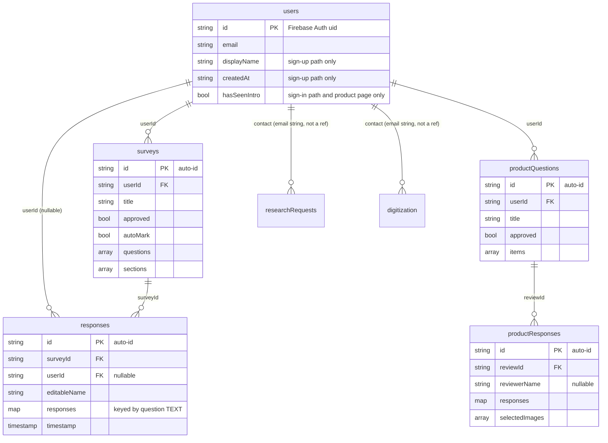

# Data Model

> **Everything in this document is INFERRED unless marked otherwise.** Firestore is
> schemaless; there is no schema file, no validation layer and no migrations in this
> project. Every shape below was reconstructed by reading the code that *writes* each
> collection, and each field is annotated with the `file:line` that writes it.
> I have not inspected production data.

Database: **Cloud Firestore** (project `kuchiki-f138f`). Seven active collections.
There is no SQL database — `dataconnect/` is unused boilerplate.

## Entity relationships



**All relationships are unenforced.** Firestore has no foreign keys. Deleting a survey
orphans its responses; nothing cleans up. (VERIFIED — no delete-cascade code exists.)

---

## `surveys`

Written by [survey/page.jsx:855-875](../app/survpages/survey/page.jsx) via
`saveSurveyData` ([utilsfirebase.js](../app/Modules/utilsfirebase.js)); updated in place by
the same file (`setDoc … { merge: true }`) and by
[approvals/surveys/page.jsx:63](../app/approvals/surveys/page.jsx) (`approved` only).

| Field | Type | Written at | Notes |
|---|---|---|---|
| `title` | string | survey/page.jsx:857 | Required; save is refused without it |
| `userId` | string | survey/page.jsx:859 | Firebase Auth uid of the creator |
| `expectedResponses` | number | survey/page.jsx:858 | Coerced to `0` when blank |
| `country`, `state` | string | survey/page.jsx:860-861 | Used for the geo-gate in `responseCol` |
| `anonymous` | bool \| null | survey/page.jsx:862 | Controls whether a respondent name is required |
| `autoMark` | bool | survey/page.jsx:863 | If true, every question must be gradeable |
| `numberedQuestions` | bool | survey/page.jsx:864 | Display concern stored with the data |
| `approved` | bool | survey/page.jsx:865 | **Always written `false`**; only staff flip it |
| `questions` | array\<Question\> | survey/page.jsx:866 | See below |
| `objectives` | `{ main, secondary, specific[] }` | survey/page.jsx:867 | |
| `sections` | array\<Section\> | survey/page.jsx:873 | Empty sections filtered out on save |
| `createdAt` | **string** (ISO 8601) | survey/page.jsx:874 | ⚠️ Not a Firestore `Timestamp` — see hazards |

### `Question` (element of `questions`)

Compiled at [survey/page.jsx:761-812](../app/survpages/survey/page.jsx):

| Field | Type | Notes |
|---|---|---|
| `question` | string | The question text — **also used as the response map key** |
| `sectionId`, `subsectionId` | string \| null | Links to a `sections[]` entry |
| `answerType` | `"Multiple Choice"` \| `"Checkboxes"` \| `"Boolean"` \| `"Open Answer"` | Derived from builder toggles |
| `choices` | string[] \| null | Only for Multiple Choice / Checkboxes |
| `ratingMode` | bool | Renders choices as a 1-5 rating |
| `checkboxLabelType` | `"numbers"` \| `"letters"` | |
| `correctAnswer` | string \| string[] \| null | Used by auto-marking |
| `subQuestion` | Question-like \| null | **One level of nesting only** |

Note there is **no stable question `id`** on the persisted question. This is the root cause
of the fragile text-matching described below.

### `Section` (element of `sections`)

`{ id, title, objective, note, showNote, numberingMode, subsections[] }` where
`numberingMode` is `"continue" | "renumber" | "blank"`, normalised by `normalizeSection`
([survey/page.jsx:89](../app/survpages/survey/page.jsx)).

---

## `responses`

Written **once** by [responseCol/page.jsx:505](../app/survpages/responseCol/page.jsx).
Never updated or deleted by any code.

| Field | Type | Notes |
|---|---|---|
| `surveyId` | string | From the URL query string |
| `editableName` | string | Respondent-entered; empty string on anonymous surveys |
| `responses` | map | **Keyed by question text** — see hazard below |
| `timestamp` | Firestore `serverTimestamp()` | The only correctly-typed timestamp in the schema |
| `anonymous` | bool | Copied from the survey at submit time |
| `userId` | string \| null | Null when the respondent is not signed in |

### The `responses` map — the most important thing to understand

`buildStructuredResponse` ([responseCol/page.jsx:321-345](../app/survpages/responseCol/page.jsx))
builds keys by concatenating a positional label with the **full question text**:

```js
// key format: "1. What is your name?"  /  sub-question: "1a. And your age?"
structured[questionKey] = subResponse
  ? { answer, subQuestions: subResponse }
  : { answer };
```

So a stored document looks like:

```json
{
  "surveyId": "abc123",
  "editableName": "Ada",
  "responses": {
    "1. How satisfied are you?": { "answer": "Very" },
    "2. Would you recommend us?": {
      "answer": "Yes",
      "subQuestions": { "2a. Why?": { "answer": "Fast support" } }
    }
  },
  "anonymous": false,
  "userId": "uid_xyz"
}
```

**Hazard (VERIFIED).** Because the question text is baked into the map key, the analysis
pages cannot look answers up by ID. They instead normalise and fuzzy-match the text —
`findMatchingKey` in [analysis/admin/page.jsx:39-47](../app/survpages/analysis/admin/page.jsx)
tries exact-normalised match, then falls back to a **substring match in either direction**.

Consequences:
1. **Editing a question's wording after responses exist silently breaks the mapping.** Old
   responses stop matching, or match the wrong question.
2. The substring fallback can mis-attribute answers between two questions where one's text
   contains the other's.
3. Any future fix requires a stable `questionId` on both the question and the response key,
   plus a migration for existing data. Do not attempt this casually.

---

## `users`

Document ID is the Firebase Auth `uid`. **Two divergent write paths produce two different
shapes** (VERIFIED):

| Field | Written by sign-up | Written by sign-in | Notes |
|---|---|---|---|
| `email` | ✅ [signup:45](../app/authentication/signup/page.jsx) | ✅ [signin:25](../app/authentication/signin/page.js) | |
| `displayName` | ✅ signup:46 | ❌ | Read by both approval dashboards |
| `createdAt` | ✅ signup:47 (ISO string) | ❌ | |
| `hasSeenIntro` | ❌ | ✅ signin:26 (`false`) | Also set `true` at [product/page.js:779](../app/product/page.js) |

Sign-in only writes the document **if it does not already exist**
(`ensureUserInFirestore`), so it never repairs a sign-up-created document. Therefore:

- Users who signed up have **no `hasSeenIntro`** field. `product/page.js:51` checks
  `if (!data.hasSeenIntro)`, which is truthy for `undefined`, so the intro shows until it is
  explicitly set to `true`. Benign today, but it is an accident, not a design.
- Users whose document was created by the sign-in path have **no `displayName`**, so the
  approval dashboards render them as `"N/A"`.

There is **no role or permission field.** Admin status is not modelled in Firestore at all —
the orphaned [app/Modules/admin.js](../app/Modules/admin.js) expects a Firebase Auth
**custom claim** (`admin: true`) instead. No code grants that claim. See
[SECURITY-FINDINGS.md](SECURITY-FINDINGS.md) C1.

---

## `productQuestions`

Written by [product/page.js:222-229](../app/product/page.js).

| Field | Type | Notes |
|---|---|---|
| `userId` | string | Creator uid |
| `title` | string | |
| `createdAt` | string (ISO 8601) | Same string-timestamp issue as `surveys` |
| `items` | array of `{ question, imageUrls[], correctImages[] }` | `imageUrls` are Cloudinary `secure_url`s |
| `isAnonymous` | bool | |
| `approved` | bool | Always written `false`; flipped by `/approvals/qanvas` |

`blob:` URLs are filtered out before write ([product/page.js:203](../app/product/page.js)) —
a deliberate guard against persisting object URLs that would be dead on reload. Preserve it.

## `productResponses`

Written by [product-review/page.jsx:70-76](../app/product-review/page.jsx).

| Field | Type | Notes |
|---|---|---|
| `reviewId` | string | FK to `productQuestions` |
| `reviewerName` | string \| null | Null when the review is anonymous |
| `responses` | map | |
| `selectedImages` | array | The images the reviewer picked |
| `submittedAt` | string (ISO 8601) | |

## `researchRequests`

Written by [research/page.jsx:38-41](../app/research/page.jsx):
`{ topic, description, urgency, flexibleDetails, contact, timestamp }`.
`contact` defaults to the signed-in user's email when left blank. `timestamp` is a proper
`serverTimestamp()`. Read only by the **unrouted** `app/Modules/emadmin.js`, so in practice
these are write-only from the app's perspective and are consumed via the email notification.

## `digitization`

Written by [digitize/page.jsx:28-31](../app/digitize/page.jsx):
`{ description, contact, route: "digitization", timestamp }`. Read by nothing.

## `productReviews` — dead

Referenced only by the broken `handleSave` in
[utilsfirebase.js:19](../app/Modules/utilsfirebase.js), which cannot execute. This
collection is almost certainly empty. (VERIFIED: no other reference exists.)

---

## Cross-cutting data hazards

### 1. `createdAt` is an ISO string, not a Firestore `Timestamp` (VERIFIED)

`surveys.createdAt` and `productQuestions.createdAt` are written with
`new Date().toISOString()`. Only `responses.timestamp` and the request collections use
`serverTimestamp()`.

Consequences:
- **Sorting is done in JavaScript, not in Firestore.** `fetchSurveyByUser`
  ([utilsfirebase.js:60-70](../app/Modules/utilsfirebase.js)) downloads every one of the
  user's surveys and sorts them client-side, then slices. The `limitCount` argument does
  **not** reduce the number of documents read — it only trims the array afterwards. This is
  a real cost and latency issue that grows with the user's survey count.
- Timestamps are client-clock-derived and therefore untrustworthy.
- Changing the type now is a breaking migration; treat as a deliberate, planned change.

### 2. Missing indexes (VERIFIED)

`firestore.indexes.json` is empty (`{"indexes": [], "fieldOverrides": []}`), yet the code
runs at least one composite query:

```js
// app/survpages/analysis/results/page.jsx:50-55
query(responsesRef, where("surveyId", "==", surveyId), orderBy("timestamp", "desc"), limit(1))
```

This requires a composite index on `responses(surveyId ASC, timestamp DESC)`. It presumably
exists in the live project, created ad hoc via the console error link — but it is **not in
version control**, so a fresh environment will fail this query at runtime. Any new
environment must recreate it.

### 3. No validation anywhere

No Firestore rules validate field presence or type ([SECURITY-FINDINGS.md](SECURITY-FINDINGS.md)
C2), and no client or server schema validation exists. Any authenticated client can write a
document of any shape into any collection.

### 4. No soft deletes, no audit trail

Nothing is ever deleted by the application, and there are no `updatedAt`, `updatedBy` or
`deletedAt` fields. `approved` is flipped with no record of who approved it or when.

### 5. Counting by download (VERIFIED)

`fetchSurveyResponses` retrieves **every response document** purely so the dashboard can
call `.length` on the result. `getCountFromServer` exists in the Firestore SDK for exactly
this. See [TECH-DEBT.md](TECH-DEBT.md) M3.
