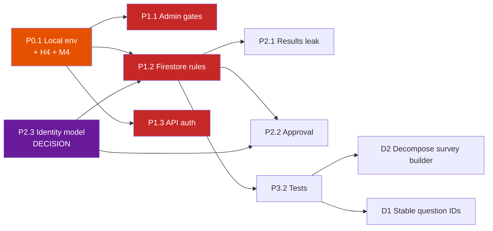

# Recommended Roadmap

> Prioritised improvements for KUCHIKI, derived from the 2026-08-22 reconnaissance pass.
> Each item states **why it matters** — not just what to do. Detail lives in
> [SECURITY-FINDINGS.md](SECURITY-FINDINGS.md) and [TECH-DEBT.md](TECH-DEBT.md).

## How to read this

Priorities are about **order of work**, not about how hard each item is. The sequence below
is deliberate: some items are prerequisites for safely doing others. In particular, the local
development environment comes before the security fixes, because a fix you cannot verify is
not a fix.

| Priority | Meaning |
|---|---|
| **CRITICAL** | Active exposure. Do before anything else. |
| **HIGH** | Real user-visible harm or data integrity risk. Next. |
| **MEDIUM** | Meaningful quality, cost or maintainability improvement. |
| **LOW** | Hygiene. Worth doing when nearby. |
| **OPTIONAL** | Only if it serves a product goal. |

---

## Phase 0 — Prerequisite: make the system runnable and verifiable

### P0.1 · Local development environment — **CRITICAL (prerequisite)**

**Why it matters.** The project cannot currently be run by anyone who does not already have
credentials: there is no `.env` file, no `.env.example`, and no setup documentation. I
confirmed that missing environment configuration is the *only* build blocker — with
placeholders the build succeeds cleanly. This single gap is why the fixes below have gone
unverified, and it is the reason to fix it first rather than last.

Scope: `.env.example` template, Firebase Emulator Suite wiring behind a flag, a seed script
producing realistic data including an admin user, npm scripts, and
[DEVELOPMENT.md](DEVELOPMENT.md).

Includes fixing **H4** (unguarded module-scope env parsing) — currently a missing variable
crashes API routes at import with an opaque 500, which is itself a barrier to running the app.

Also captures **M4** (composite indexes missing from version control), because the emulator
surfaces exactly which indexes are required.

---

## Phase 1 — Close the active exposure

### P1.1 · Remove the client-side admin gates — **CRITICAL**

**Why it matters.** The admin password is in a publicly served JavaScript chunk, and I
verified that using it grants access to the staff approval dashboard **with no Firebase
sign-in at all**. This is the most directly exploitable finding in the codebase: no account,
no guesswork, just a `curl` and a form field.

Replace both gates ([SECURITY-FINDINGS.md](SECURITY-FINDINGS.md) C1) with `PrivateRoute` plus
the Firebase Auth `admin` custom claim, using the already-written `currentUserIsAdmin()`.
Add a script to grant the claim. **Treat the password as compromised and rotate it anywhere
else it is used** — whether it is reused elsewhere is currently UNKNOWN and needs a human
answer.

### P1.2 · Rewrite `firestore.rules` — **CRITICAL**

**Why it matters.** This is the highest-leverage change in the entire codebase. The current
rule grants every authenticated user read *and write* on every document, which means: any
self-service signup can read all users' surveys, all respondents' answers, and all email
addresses; and can delete or tamper with any of it. It is also *why* every other client-side
control in the app is unenforceable — fixing it converts a dozen advisory checks into real
ones.

⚠️ **Two questions must be answered before writing the rules** (see C2): whether anonymous
public response submission is intended, and whether production holds documents without a
`userId` that ownership rules would lock out. Validate with emulator rules tests, then re-run
the full survey lifecycle to prove nothing regressed.

### P1.3 · Authenticate the API routes — **CRITICAL**

**Why it matters.** `/api/sendsurvema` is an open email relay: it accepts an arbitrary
recipient list and an arbitrary link, and sends from your verified Resend domain. Beyond the
direct harm to recipients, this risks domain blacklisting and account suspension — the kind
of damage that outlives the fix. I verified no auth check exists by probing without an
`Authorization` header.

Apply the `requireUser` / `requireAdmin` helpers that already exist and are wired to nothing,
move `_auth.js` out of the routed directory (**M1**), add input validation and recipient
caps, escape HTML interpolation, and have `notify-unapproved` query Firestore rather than
trusting the request body.

---

## Phase 2 — Correctness and enforcement

### P2.1 · Fix the results-page cross-participant leak — **HIGH**

**Why it matters.** Respondents currently see **each other's answers and scores**. The
results query filters by survey only and takes the globally-latest response. It is both a
confidentiality breach and a plain correctness bug — users are shown a score that is not
theirs. Small, contained fix ([SECURITY-FINDINGS.md](SECURITY-FINDINGS.md) B1).

### P2.2 · Enforce survey approval — **HIGH**

**Why it matters.** The approval workflow — including the staff dashboards and email
notifications built to support it — is bypassed by navigating directly to the response URL.
`responseCol` never checks `approved`. The whole feature is currently decorative (**H1**).

### P2.3 · Restore public survey response via anonymous auth — **HIGH**

**RESOLVED 2026-08-22.** Public, no-signup response **is** the intended behaviour. That
confirmation turns this from an open question into a confirmed production outage: every
response from a non-registered respondent is currently rejected by the Firestore rule and
lost, with the respondent seeing only a generic error. See
[SECURITY-FINDINGS.md](SECURITY-FINDINGS.md#b2) **B2**.

**Why it matters.** This is a functional outage of the core product loop — the platform
exists to collect survey data from external audiences, and it currently cannot. It went
unnoticed because internal testing happens while signed in as a creator, where the rule
passes.

**What to do**, as part of P1.2 rather than after it:

1. `signInAnonymously` on entry to `responseCol`, giving every respondent a stable
   `request.auth.uid` without a signup step.
2. Scope the `responses` create rule to accept anonymous principals; restrict reads to the
   survey owner and admins.
3. Replace the generic submit-failure toast with a message that distinguishes a permission
   failure from a network failure.

This also unblocks two other findings: it gives **H3** (duplicate prevention) a real identity
to key on — currently non-functional, since the `localStorage` key is written in three places
and read in zero — and gives **B1** a reliable `userId` to filter results by.

### P2.4 · Server-side geo-restriction, or drop it — **HIGH**

**Why it matters.** Two problems in one feature (**H2**). The restriction is not enforceable
because it runs in the respondent's browser; and every respondent's IP is sent to ipapi.co
without disclosure, which is a likely GDPR/UK GDPR issue given IP addresses are personal
data. **The privacy disclosure deserves review by someone with compliance responsibility, not
just an engineering fix.** Decide whether the feature is worth a server-side implementation
or should be removed.

---

## Phase 3 — Quality, cost and maintainability

### P3.1 · Fix N+1 and serial dashboard queries — **MEDIUM**

**Why it matters.** Dashboards issue one Firestore query per survey, sequentially, and
download every response document purely to call `.length` on the array. Firestore bills per
document read, so this is a direct and growing cost as well as a latency problem.
`fetchSurveyByUser`'s `limitCount` is applied *after* the fetch, so it saves nothing. Safe,
well-contained, and immediately measurable (**M3**).

### P3.2 · Add tests, starting with security rules — **MEDIUM**

**Why it matters.** There is not a single test in the project. This is why every item in
[TECH-DEBT.md](TECH-DEBT.md) is risky to address — there is no safety net. Start with
Firestore rules tests (the emulator supports them natively, and rules are the only real
authorization boundary, so it is the highest value per line of test code), then the pure
helpers in `survey/page.jsx`, then the auto-mark scoring arithmetic that users see as their
score.

### P3.3 · Rate limiting and bot protection — **MEDIUM**

**Why it matters.** Amplifies the email abuse and ballot-stuffing risks above.
`react-google-recaptcha-v3` is **already installed and imported nowhere** — the intent was
there. Add rate limiting to API routes and consider Firebase App Check for the Firestore
path (**M3** in security findings).

### P3.4 · Security headers and CSP — **MEDIUM**

**Why it matters.** `next.config.mjs` is empty; there is no CSP, no `X-Frame-Options`, no
`Referrer-Policy`. The app is framable, which matters given the one-click "Approve Survey"
buttons. Add headers as a quick win, but treat **CSP as its own task** — it needs testing
against Ant Design, inline styles, and the Cloudinary/ipapi/Firebase origins (**M4**).

### P3.5 · Harden the Cloudinary upload path — **MEDIUM**

**Why it matters.** The unsigned upload preset is public by design, so anyone can upload
arbitrary files to your account. **Most of this is mitigable in the Cloudinary dashboard with
no code change** — restrict formats, size and target folder. Signed uploads are the stronger
fix if the exposure warrants it (**M2**).

### P3.6 · Configure Tailwind `darkMode: 'class'` — **MEDIUM**

**Why it matters.** Dark mode is visibly inconsistent because two mechanisms are half-applied:
the toggle sets a `.dark` class, but Tailwind defaults to `'media'`, so every `dark:` variant
in the codebase ignores the toggle and responds to the OS setting instead.

⚠️ **Larger than it looks.** The one-line fix activates every currently-inert `dark:` class
across all 24 pages simultaneously. Budget a page-by-page visual review; do not ship it blind
(**M5**).

### P3.7 · Resolve the deployment story — **MEDIUM**

**Why it matters.** `firebase.json` has no rewrites, so the GitHub Actions workflows build the
app and then publish only the four static files in `public/` — Firebase Hosting cannot serve
this application as configured. Meanwhile an API route references `kuchiki.vercel.app`.
Either wire hosting to the existing `functions/index.js` SSR wrapper, or delete the dead
Firebase Hosting config so it stops misleading people. Deferred while we work locally.

### P3.8 · Audit dependencies — **MEDIUM**

**Why it matters.** `npm audit` was not run in this pass, so vulnerability status is
**UNKNOWN** — worth establishing. Separately, 12 dependencies are imported by nothing
(**L3**), which is both bundle weight and unnecessary supply-chain surface.

---

## Phase 4 — Hygiene

### P4.1 · Fix `README.md` — **LOW**

Unresolved merge-conflict markers are committed, with the real project description buried
beneath two copies of create-next-app boilerplate. **Why it matters:** it is the first thing
a new developer sees, and it costs nothing to fix.

### P4.2 · Remove dead code and configuration — **LOW**

The `surveyregion` Leaflet components (and the five Leaflet packages that exist only for
them), the unrouted `emadmin.js`, the broken `handleSave`, the commented-out `dataconnect/`
boilerplate, `lin.pcapng`, `.vs/slnx.sqlite`, `JavaSript/new.html`. **Why it matters:** every
dead file is a thing future readers must rule out. Verify each individually — and check with
the author before deleting `motion.js`, which may represent an unfinished decision.

### P4.3 · Runtime hygiene — **LOW**

Remove `console.log` of personal data; replace `window.location.reload()` with proper state
refresh (6 sites, one on a 10-second timer); unify `alert()` onto `react-hot-toast`; add
error boundaries; fix the `[user]` dependency on the auth subscription in `authcont.js:20`.
**Why it matters:** individually trivial, collectively the difference between a codebase that
feels maintained and one that does not. Note the `reload()` calls are masking missing state
updates, so each removal needs the refetch it was standing in for.

### P4.4 · Add linting — **LOW**

`npm run lint` is configured but there is no ESLint config for the Next app — only one
covering the dead `functions/` directory. **Why it matters:** the lint script currently gives
false assurance.

---

## Deliberately deferred — needs a decision, not just engineering

These are **not** recommendations to act. They are questions that must be answered by a human
before any work is justified.

### D1 · Stable question IDs — **HIGH impact, but do not start casually**

Responses are keyed by **question text**, so the analysis pages fuzzy-match strings, with a
bidirectional substring fallback. Editing a question's wording after responses exist silently
breaks the mapping, and similar questions can be mis-attributed
([TECH-DEBT.md](TECH-DEBT.md) D1).

The fix is correct and valuable — but it is a **breaking schema change requiring migration of
every existing response document**. It needs its own plan, a backfill script and a dual-read
compatibility period. Do not attempt it as a side effect of another task.

### D2 · Decompose `survey/page.jsx` — **OPTIONAL**

2,778 lines, roughly a quarter of the hand-written application. Real cost, but high risk to
change while untested. **Do P3.2 first.** Then extract pure helpers, then presentational
components, and leave the state machine until last. No big-bang rewrite.

### D3 · Deduplicate the `ranked` / `competeRanked` pairs — **OPTIONAL**

1,684 lines across four files in two apparently-forked pairs. **Why they exist is UNKNOWN** —
two commits of history give no signal. They may be deliberate product variants or abandoned
iterations. Establish which before touching; deduplication would remove ~800 lines, but only
if the variants are genuinely redundant.

### D4 · Migrate timestamps to Firestore `Timestamp` — **OPTIONAL**

Would enable server-side ordering and remove the full-download sort, but requires a type
migration across existing documents plus every read site. Pair with D1 if either is tackled.

---

## Suggested sequence

The critical path runs through **P0.1 → P1.2**. P2.3 is drawn as an input to the rules work
because it is a decision that shapes it, not a task that follows it.

---

## Open questions blocking work

1. **Is public/anonymous survey response intended?** Blocks P1.2 and P2.3.
2. **Who should be an admin?** No role model exists anywhere; the claim-granting mechanism
   must be created. Blocks P1.1.
3. **Does production contain documents without a `userId`?** Ownership rules would lock them
   out permanently. Blocks P1.2 deployment.
4. **Is the compromised password reused anywhere else?** Determines the rotation scope for P1.1.
5. **Why do the `ranked` / `competeRanked` pairs both exist?** Blocks D3.
6. **Are the unbuilt features implied by the unused dependencies still planned** (document
   export, CSV, QR codes)? Blocks part of P3.8.
